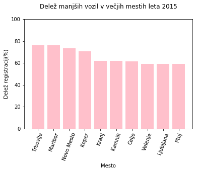
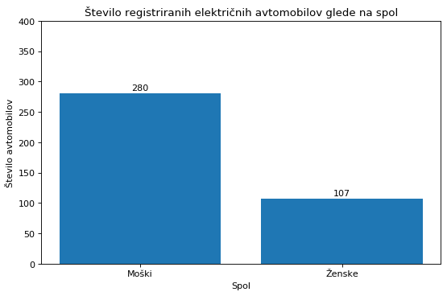

# PR19ARMM - Analiza novo registriranih avtomobilov v Sloveniji skozi leta
## Vmesno poročilo

## Ekipa
* Andraž Raspor
* Matjaž Možina

## Podatki
Vir: https://podatki.gov.si/dataset/prvic-registrirana-vozila-po-mesecih
Uporabljala bova podatke iz portala Odprti podatki Slovenije. Vzela sva množico podatkov o prvic registriranih vozilih v Sloveniji po mesecih. Ker je podatkov ogromno, sva se odločila vzeti le podatke iz let 2012, 2015, 2018 in prvih dveh mesecev leta 2019. Vsi podatki so v formatu csv.

Za te podatke sva se odločila, ker naju zanimajo spremembe pri nakupovanju avtomobilov skozi leta. Želiva ugotoviti za kakšne tipe avtomobilov se Slovenci raje odločamo glede na tip goriva, nazivno moč, porabo, itd. Velik poudarek bova postavila tudi na trend električnih avtomobilov, ki postajajo vedno bolj popularni.

Podatki so beleženi od leta 2012 naprej, zaradi velike količine pa sva, kot sem že prej omenil, vzela le podatke iz določenih let. Nekaj težav nama je povzročal sam format podatkov. Leta 2015 so namreč spremenili obliko zapisa podatkov, dodali so tudi veliko več informacij o vozilih.

Za branje podatkov sva uporabila knjižnico pandas, ki omogoča enostavno branje formata csv. Ker podatki vsebujejo tudi šumnike, sva uporabila encoding cp1252.

## Opis atributov in vrednosti
Za najine potrebe vsi stolpci niso bili potrebni. Iz podatkov iz let 2015, 2018 in 2019 sva vzela le naslednje stolpce:

* Datum prve registracije, kjerkoli in nato še samo v SLO - zvezna atributa
* Status vozila - diskretni atribut (odjavljeno, registrirano, v postopku)
* Izvajalna enota prve registracije - diskretni atribut
* Starost uporabnika vozila - zvezni atribut
* Ali je uporabnik pravna ali fizicna oseba  - diskretni atribut (P ali F)
* Spol uporabnika - diskretni atribut - (M ali Z, prazno če je oseba pravna)
* Upravna enota - diskretni atribut
* Občina - diskretni atribut
* Starost lastnika vozila - zvezni atribut
* Znakma - diskretni atribut (Audi, Alfa Romeo, Volkswagen...)
* barva - diskretni atribut (kovinski-BELA-SREDNJA, kovinski-BELA-SVETLA...)
* teža vozila - zvezni atribut
* Vrsta goriva - diskretni atribut (bencin, dizel, zem. plin...)
* Število sedežev (število) - diskretni atribut
* Dolžina, širina in višina - zvezni atributi
* Leto izdelave - diskretni atribut

Ker so bile leta 2012 drugačne oznake in manj stolpcev, sva iz tistih podatkov vzela vse stolpce.

## Vprašanja oz. hipoteze

Poskušala bova odgovoriti na naslednja vprašanja:

* Kakšne so razlike pri registriranih avtomobilih med obema spoloma (ali moški kupujejo močnejše, večje avtomobile, ali ženske bolj gledajo na porabo kot moški, itd.)?
* Razlika po številu na novo registriranih dizelskih in benzinskih avtomobilov v zadnjih šestih letih?
* Ali v večjih mestih prevladujejo manjši avtomobili proti večjim?
* Kakšne avtomobile raje kupujejo mladi vozniki (glede na nazivno moč, porabo, ...)?
* V katerem starostnem obdobju se prebivalci Slovenije raje odločajo za električna vozila, ali na to vpliva tudi spol?
* Ali se Slovenci v zadnjih letih raje odločajo za električna vozila?

## Ugotovitve

### Razlika po številu na novo registriranih dizelskih in benzinskih avtomobilov v zadnjih šestih letih.
Pri tej hipotezi sva želela prikazati razliko med novo registriranimi vozili na bencin in dizel, skozi zadnjih nekaj let.
Za prikaz sva uporabila podatke o registracijah iz let 2012, 2015,2018 in 2019 oz. sprememba na vsaka 3 leta.

Kot lahko razberemo iz grafa so v splošnem dizelska vozila veliko bolj priljubljena kot bencinska, priljubljenost pa z leti tudi narašča.
Vidimo lahko tudi, da se samo število novih registracij enakomerno veča skozi leta.
Pri vozilih na bencin opazimo, da je število registracij v letih 2012 in 2015 približno enako, medtem ko v letu 2018 naraste za 45%.
Število registracij dizelskih vozil pa se veča bolj enakomerno, kjer je še vedno večji preskok med leti 2015 in 2018.

Prikazala sva tudi podatke za leto 2019, vendar sva imela na voljo podatke le za mesec januar in februar, kar nama ne pomaga pri dokazovanju hipoteze.
Še vedno pa lahko vidimo, da so tudi v letošnjem letu bolj priljubljena dizelska vozila.

### Ali v večjih mestih prevladujejo manjši avtomobili proti večjim?
Cilj te hipoteze je bil ugotoviti ali se ljudje v večjih slovenskih mestih raje odločajo za manjša vozila.
Za prikaz sva uporabila podatke iz let 2015 ter 2018 in sicer za 10 največjih Slovenskih mest. Vozila sva razdelila v kategorije tako, da sva velikost primerjala s povprečno dolžino kombilimuzine(Hatchback), kar je 4465mm.
Na grafu je število registracij pikazano kot odstotek manjših vozil od vseh registriranih vozil v tem mestu.

2015:
Kot lahko razberemo iz grafa za leto 2015 so bila manjša vozila s kar 60 odstotki veliko bolj popularna kot večja vozila.
Vidimo lahko tudi, da v Trbovljah, Mariboru, Novem Mestu in Kamniku prevladujejo s kar 70 odstotki.
Manjša vozila pa so bila v letu 2015 najbolj priljubljena v Trbovljah.

2018:
V letu 2018 je priljubljenost manjših vozil nekoliko upadla, vendar je še vedno v večinskem deležu.
Manjša vozila v tem letu najbolj prevladujejo v Novem Mestu, Trbovljah, Mariboru in Kopru.
V letu 2018 pa je za razliko od 2015 največji delež manjših vozil V Novem mestu, ki je bilo prej na 3. mestu po številu registracij.
Zanimiva je tudi ugotovitev, da je delež manjših vozil v Ljubljani najmanjši in so vozila približno v enakem razmerju. Ker je Ljubljana glavno mesto sva pričakovala, da bodo manjša vozila prevladovala v veliki večini.
Sklepava, da na majhen delež vpliva več faktorjev. Sama občina Ljubljane je
velika, ljudje ki živijo v okolici pa verjetno ne gledajo toliko na samo
velikost avtomobila.
Veliko vozil je tudi v lasti pravnih oseb. Različna podjetja in ustanove uporabljajo službena vozila za vožnje na daljše razdalje, ponavadi med sedeži podjetij v različnih mestih.
Verjetno ne gledajo preveč na velikost avtomobilov, oziroma še raje uporabljajo večja vozila za prevoz večih uslužbencev.

### Ali se Slovenci v zadnjih letih raje odločajo za električna vozila?
Pri tej hipotezi naju je zanimalo ali se število električnih avtomobilov v Sloveniji povečuje. Glede na to, da so se električni avtomobili v zadnjih letih zelo razvili ter so sedaj veliko bolj učinkoviti, močnejši ter cenejši kot včasih, sva pričakovala narastek v registracijah električnih avtomobilov.

Izkazalo se je, da sva sklepala pravilno.
Število na novo registriranih električnih avtomobilov iz leta v leto narašča.
Leta 2012 je bilo namreč registriranih le 24 takšnih osebnih vozil, leta 2015 je to število krepko naraslo na 144 električnih avtomobilov, leta 2018 pa je bilo registriranih 569 električnih avtomobilov.
V januarju in februarju letošnjega leta je bilo registriranih že 99 električnih osebnih vozil, kar je več kot celega leta 2012.

Zanimalo naju je tudi, katera znamka je najbolj popularna v Sloveniji. Iz spodnjega grafa je razvidno, da je največ registriranih avtomobilov znamke Renault, blizu sta ji Nissan in BMW, kar nekaj avtomobilov pa je tudi znamk Smart, Hyundai in Volkswagen. To so števila za leta 2012, 2015 in 2018 skupaj.

### V katerem starostnem obdobju se prebivalci Slovenije raje odločajo za električna vozila, ali na to vpliva tudi spol?
Ker se je število električnih avtomobilov krepko povečalo, naju je zanimalo ali na nakup električnih vozil vplivata starost in spol uporabnika. Sklepava, da se za tovrstne avtomobile odločajo starejše starostne skupine, misliva pa da spol nima prevelikega vpliva na to.

Iz spodnjega grafa je razvidno, da so moški registrirali več električnih avtomobilov kot ženske.
Možno je, da moški na sploh registrirajo več avtomobilov, zato tukaj ne moremo zagotovo trditi, da spol vpliva na nakup električnih avtomobilov.

Opazila sva, da je v zgornjem grafu manj kot polovica vseh registriranih električnih osebnih vozil.
To pomeni, da več kot polovico takšnih vozil uporabljajo pravne osebe in ne fizične, kar je tudi razvidno iz spodnjega grafa.

