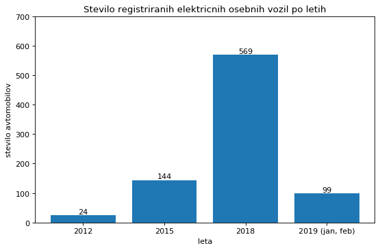

# PR19ARMM - Analiza novo registriranih avtomobilov v Sloveniji skozi leta
## Vmesno poročilo

## Ekipa
* Andraž Raspor
* Matjaž Možina

## Podatki
Vir: https://podatki.gov.si/dataset/prvic-registrirana-vozila-po-mesecih
Uporabljala bova podatke iz portala Odprti podatki Slovenije. Vzela sva množico podatkov o prvic registriranih vozilih v Sloveniji po mesecih. Ker je podatkov ogromno, sva se odločila vzeti le podatke iz let 2012, 2015, 2018 in prvih dveh mesecev leta 2019. Vsi podatki so v formatu csv.

Za te podatke sva se odločila, ker naju zanimajo spremembe pri nakupovanju avtomobilov skozi leta. Želiva ugotoviti za kakšne tipe avtomobilov se Slovenci raje odločamo glede na tip goriva, nazivno moč, porabo, itd. Velik poudarek bova postavila tudi na trend električnih avtomobilov, ki postajajo vedno bolj popularni.

Podatki so beleženi od leta 2012 naprej, zaradi velike količine pa sva, kot sem že prej omenil, vzela le podatke iz določenih let. Nekaj težav nama je povzročal sam format podatkov. Leta 2015 so namreč spremenili obliko zapisa podatkov, dodali so tudi veliko več informacij o vozilih.

Za branje podatkov sva uporabila knjižnico pandas, ki omogoča enostavno branje formata csv. Ker podatki vsebujejo tudi šumnike, sva uporabila encoding cp1252.

## Opis atributov in vrednosti
Za najine potrebe, vsi stolpci niso bili potrebni. Iz podatkov iz let 2015, 2018 in 2019 sva vzela le naslednje stolpce:

* Datum prve registracije, kjerkoli in nato še samo v SLO - zvezna atributa
* Status vozila - diskretni atribut (odjavljeno, registrirano, v postopku)
* Izvajalna enota prve registracije - diskretni atribut
* Starost uporabnika vozila - zvezni atribut
* Ali je uporabnik pravna ali fizicna oseba  - diskretni atribut (P ali F)
* Spol uporabnika - diskretni atribut - (M ali Z, prazno če je oseba pravna)
* Upravna enota - diskretni atribut
* Občina - diskretni atribut
* Starost lastnika vozila - zvezni atribut
* Znakma - diskretni atribut (Audi, Alfa Romeo, Volkswagen...)
* barva - diskretni atribut (kovinski-BELA-SREDNJA, kovinski-BELA-SVETLA...)
* teža vozila - zvezni atribut
* Vrsta goriva - diskretni atribut (bencin, dizel, zem. plin...)
* Število sedežev (število) - diskretni atribut
* Dolžina, širina in višina - zvezni atributi
* Leto izdelave - diskretni atribut

Ker so bile leta 2012 drugačne oznake in manj stolpcev, sva iz tistih podatkov vzela vse stolpce.

## Vprašanja oz. hipoteze

Poskušala bova odgovoriti na naslednja vprašanja:

* Kakšne so razlike pri registriranih avtomobilih med obema spoloma (ali moški kupujejo močnejše, večje avtomobile, ali ženske bolj gledajo na porabo kot moški, itd.)?
* Razlika po številu na novo registriranih dizelskih in benzinskih avtomobilov v zadnjih šestih letih?
* Ali v večjih mestih prevladujejo manjši avtomobili proti večjim?
* Kakšne avtomobile raje kupujejo mladi vozniki (glede na nazivno moč, porabo, ...)?
* V katerem starostnem obdobju se prebivalci Slovenije raje odločajo za električna vozila, ali na to vpliva tudi spol?
* Ali se Slovenci v zadnjih letih raje odločajo za električna vozila?

## Ugotovitve

### Razlika po številu na novo registriranih dizelskih in benzinskih avtomobilov v zadnjih šestih letih?

### Ali v večjih mestih prevladujejo manjši avtomobili proti večjim?

### Ali se Slovenci v zadnjih letih raje odločajo za električna vozila?
Pri tej hipotezi naju je zanimalo ali se število električnih avtomobilov v Sloveniji povečuje. Glede na to, da so se električni avtomobili v zadnjih letih zelo razvili ter so sedaj veliko bolj učinkoviti, močnejši ter cenejši kot včasih, sva pričakovala narastek v registracijah električnih avtomobilov.

Vzela sva podatke iz let 2012, 2015, 2018 in prvih dveh mesecev leta 2019, da bi lahko primerjala število električnih avtomobilov skozi leta. Izkazalo se je, da sva sklepala pravilno. Število na novo registriranih električnih avtomobilov iz leta v leto narašča. Leta 2012 je bilo namreč registriranih le 24 takšnih osebnih vozil, leta 2015 je to število krepko naraslo na 144 električnih avtomobilov, leta 2018 pa je bilo registriranih 569 električnih avtomobilov. V januarju in februarju letošnjega leta je bilo že registriranih 99 električnih osebnih vozil. Vse to je razvidno iz grafa, kjer je prikazano število registracij vsako leto.

Zanimalo naju je tudi, katera znamka je najbolj popularna v Sloveniji. Iz zgornjega grafa je razvidno, da je največ registriranih avtomobilov znamke Renault, blizu sta ji Nissan in BMW, kar nekaj avtomobilov pa je tudi znamk Smart, Hyundai in Volkswagen. To so števila za leta 2012, 2015 in 2018 skupaj.

### V katerem starostnem obdobju se prebivalci Slovenije raje odločajo za električna vozila, ali na to vpliva tudi spol?

